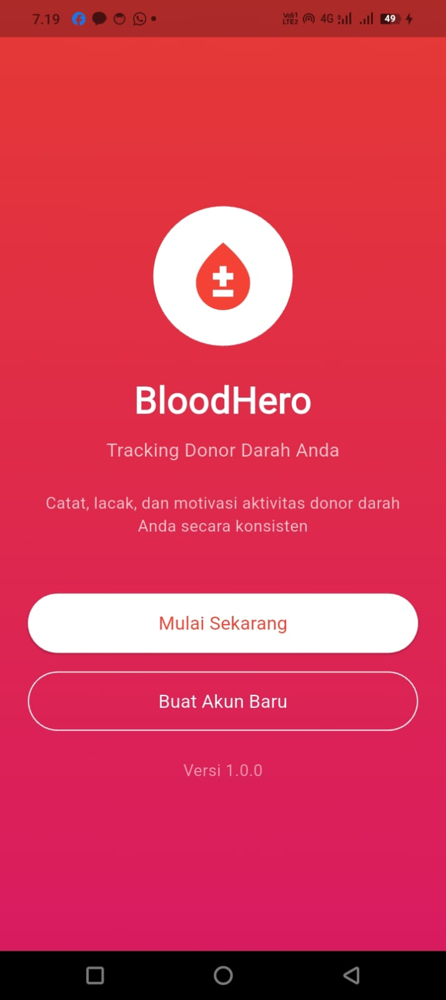
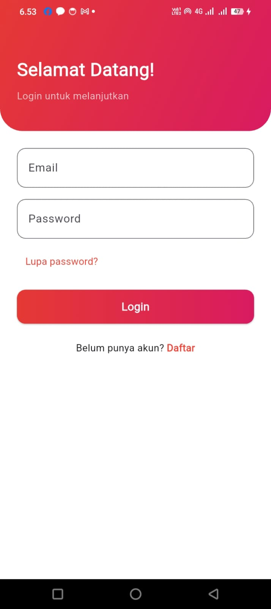
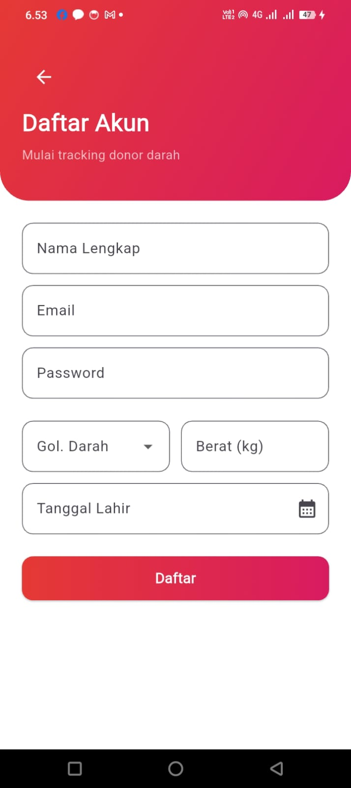
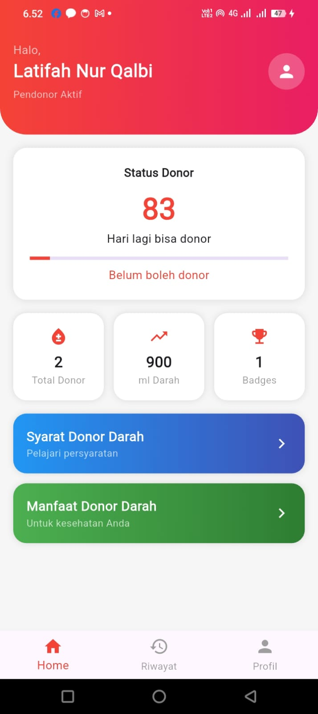
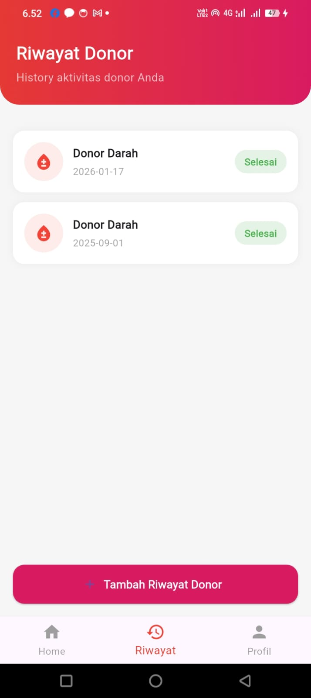
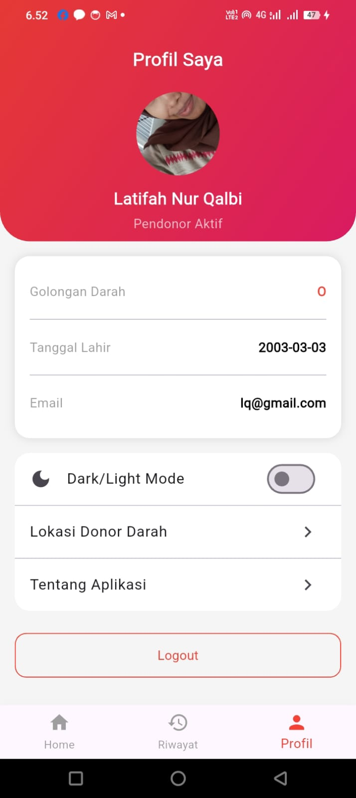
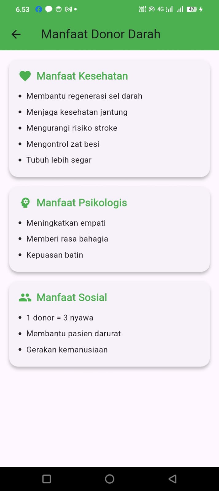
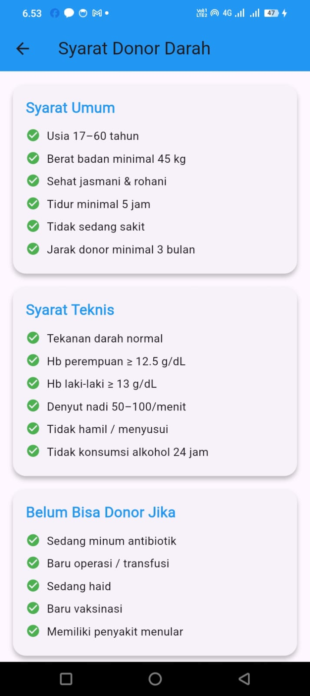
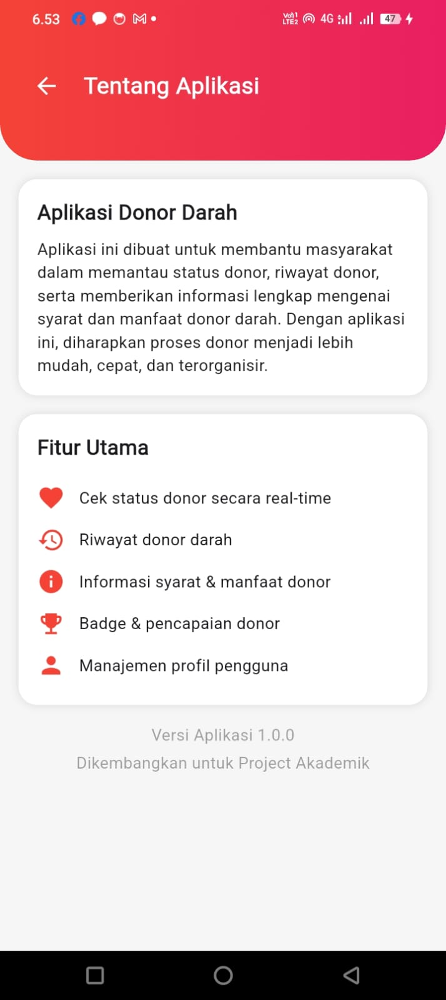

# 🩸 BloodHero
Aplikasi mobile untuk membantu pengguna mencatat, melacak, dan memantau aktivitas donor darah secara konsisten.

---

## 📱 Tentang Aplikasi
**BloodHero** adalah aplikasi donor darah berbasis **Flutter** yang dirancang untuk membantu masyarakat dalam memantau aktivitas donor darah secara mudah dan terorganisir.

Aplikasi ini memungkinkan pengguna untuk:
- Menyimpan data profil pendonor
- Melacak riwayat donor darah
- Mengetahui waktu donor berikutnya
- Mempelajari syarat dan manfaat donor darah

Aplikasi ini dikembangkan sebagai **Project Akademik**.

---

## ✨ Fitur Utama
- 🔐 Login & Registrasi pengguna
- 👤 Manajemen profil pendonor
- 🩸 Riwayat aktivitas donor darah
- ⏳ Status & countdown waktu donor berikutnya
- 📘 Informasi syarat donor darah
- ❤️ Informasi manfaat donor darah
- 🏆 Badge & pencapaian pendonor
- 🌙 Mode gelap & terang (Dark/Light Mode)

---

## 🛠️ Teknologi yang Digunakan
- **Flutter**
- **Dart**
- **Provider** (State Management)
- **Material Design**
- **Local Storage / Backend API** (sesuai implementasi)

---

## 📸 Tampilan Aplikasi

### Welcome Page


### Halaman Login


### Halaman Registrasi


### Beranda


### Riwayat Donor


### Profil Pengguna


### Manfaat Donor Darah


### Syarat Donor Darah


### Tentang Aplikasi



---

## 🚀 Cara Menjalankan Aplikasi
1. Pastikan Flutter sudah terinstall
2. Jalankan perintah berikut:
```bash
flutter pub get
flutter run